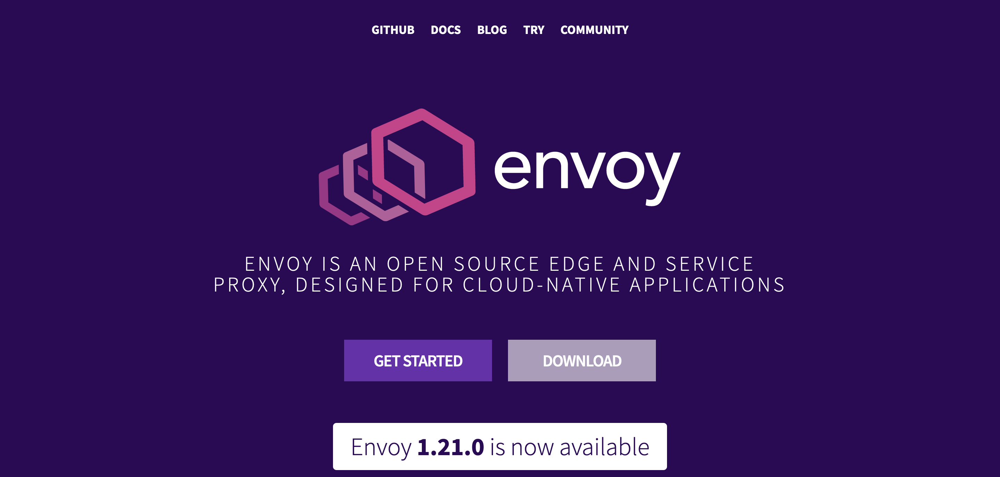

## Dynamic configuration from control plane

There are already some production ready control planes available like

1. Gloo
2. Istio

We are going to experiment with what's at the core of these service meshes - [Go control plane](https://github.com/envoyproxy/go-control-plane)

In order to tell envoy where to look for the control plane for getting the configuration we need some of the following things:

1. [node](https://www.envoyproxy.io/docs/envoy/v1.20.1/start/quick-start/configuration-dynamic-control-plane#start-quick-start-dynamic-node)
2. [dynamic_resources](https://www.envoyproxy.io/docs/envoy/v1.20.1/start/quick-start/configuration-dynamic-control-plane#start-quick-start-dynamic-dynamic-resources)
3. [static_resources](https://www.envoyproxy.io/docs/envoy/v1.20.1/start/quick-start/configuration-dynamic-control-plane#start-quick-start-dynamic-static-resources)

---

### node

The node configuration remains the same as in the previous setup of the envoy configurations:

```yaml
node:
  cluster: test-cluster
  id: test-id
```

### dynamic_resources

This tells envoy which configurations to update dynamically

```yaml
dynamic_resources:
  ads_config:
    api_type: GRPC
    transport_api_version: V3
    grpc_services:
      envoy_grpc:
        cluster_name: xds_cluster
  cds_config:
    resource_api_version: V3
    ads: {}
  lds_config:
    resource_api_version: V3
    ads: {}
```

This basically tells envoy that the `Cluster Discovery Service` and the `Listener Discovery Service` are being served as part of the `ADS` (`Aggregate Discovery Service`). The `ads` configuration itself is a GRPC api served by a `cluster` named `xds_cluster`.

### static_resources

This will tell envoy where to receive its dynamic configuration from, i.e. where to find the control plane

```yaml
static_resources:
  clusters:
  - type: STRICT_DNS
    typed_extension_protocol_options:
      envoy.extensions.upstreams.http.v3.HttpProtocolOptions:
        "@type": type.googleapis.com/envoy.extensions.upstreams.http.v3.HttpProtocolOptions
        explicit_http_config:
          http2_protocol_options: {}
    name: xds_cluster
    http2_protocol_options: {}
    connect_timeout: 3s
    load_assignment:
      cluster_name: xds_cluster
      endpoints:
      - lb_endpoints:
        - endpoint:
            address:
              socket_address:
                address: localhost
                port_value: 18000
```

Here we define the details of where can envoy find the previously specified `xds_cluster` serving the `ADS` configuration.

This is the basic configuration that we need to bootstrap our envoy instance to connect to our control plane and start getting updated configuration from it. The main advantage of this pattern over the previously described ones is that we can now take advantage of the powerful programmable API of the control plane and update the configuration programmatically. So lets see ho we can get this done.

## Control Plane

At the heart of the control place configuration, there's what envoy calls a `Snapshot`. Going through the envoy docs, this is what the definition of a snapshot says it is:
> Snapshot is an internally consistent snapshot of xDS resources

And what does the `Snapshot` look like you may ask?

```go
type Snapshot struct {
	Resources [types.UnknownType]Resources

	// VersionMap holds the current hash map of all resources in the snapshot.
	// This field should remain nil until it is used, at which point should be
	// instantiated by calling ConstructVersionMap().
	// VersionMap is only to be used with delta xDS.
	VersionMap map[string]map[string]string
}
```

Hmm, that isn't very helpful. It doesn't give us much information about what does the `Resources` hold. On further examiniation of the docs, I found the following method in the [cache package](https://pkg.go.dev/github.com/envoyproxy/go-control-plane/pkg/cache/v3):

```go
func NewSnapshot(version string, resources map[resource.Type][]types.Resource) (Snapshot, error)
```

And examining the [resource](https://pkg.go.dev/github.com/envoyproxy/go-control-plane@v0.10.1/pkg/resource/v3) package we get these constants

```go
const (
	EndpointType        = apiTypePrefix + "envoy.config.endpoint.v3.ClusterLoadAssignment"
	ClusterType         = apiTypePrefix + "envoy.config.cluster.v3.Cluster"
	RouteType           = apiTypePrefix + "envoy.config.route.v3.RouteConfiguration"
	ScopedRouteType     = apiTypePrefix + "envoy.config.route.v3.ScopedRouteConfiguration"
	ListenerType        = apiTypePrefix + "envoy.config.listener.v3.Listener"
	SecretType          = apiTypePrefix + "envoy.extensions.transport_sockets.tls.v3.Secret"
	ExtensionConfigType = apiTypePrefix + "envoy.config.core.v3.TypedExtensionConfig"
	RuntimeType         = apiTypePrefix + "envoy.service.runtime.v3.Runtime"

	// AnyType is used only by ADS
	AnyType = ""
)
```

So now it makes sense – the snapshot is just a fancy register that will store a point-in-time snapshot of the envoy configuration for different envoy resources like `listener`, `route`, `endpoint` etc. This is good but is there anything better? – a better abstraction that we can probably use? It turns out there is. On further examination I found the [SnapshotCache](https://pkg.go.dev/github.com/envoyproxy/go-control-plane/pkg/cache/v3#SnapshotCache) :

```go
type SnapshotCache interface {
	Cache

	SetSnapshot(ctx context.Context, node string, snapshot Snapshot) error

	GetSnapshot(node string) (Snapshot, error)

	ClearSnapshot(node string)

	GetStatusInfo(string) StatusInfo

	GetStatusKeys() []string
}

func NewSnapshotCache(ads bool, hash NodeHash, logger log.Logger) SnapshotCache
```

> SnapshotCache is a snapshot-based cache that maintains a single versioned snapshot of responses per node. SnapshotCache consistently replies with the latest snapshot

Alright now we have some idea of the structure we want to put around this thing:


We will start implementing the same in the following snippets:

```go
func GenerateSnapshot(listenerName, routeName, clusterName, upstreamHost string, listenerPort, upstreamPort uint32) cache.Snapshot {
	return cache.NewSnapshot("1",
		// endpoints
		[]types.Resource{},
		// clusters
		[]types.Resource{makeCluster(clusterName, upstreamHost, upstreamPort)},
		// routes
		[]types.Resource{makeRoute(routeName, clusterName, upstreamHost)},
		// listeners
		[]types.Resource{makeListener(listenerName, routeName, listenerPort)},
		// runtimes
		[]types.Resource{},
		// secrets
		[]types.Resource{},
	)
}
```

Now we implement the methods `makeCluster`, `makeRoute`, `makeListener`:

### Cluster and Endpoint

```go
import (
	"time"

	cluster "github.com/envoyproxy/go-control-plane/envoy/config/cluster/v3"
	"github.com/golang/protobuf/ptypes"

	core "github.com/envoyproxy/go-control-plane/envoy/config/core/v3"
	endpoint "github.com/envoyproxy/go-control-plane/envoy/config/endpoint/v3"
)

func makeCluster(clusterName, upstreamHost string, upstreamPort uint32) *cluster.Cluster {
	return &cluster.Cluster{
		Name:           clusterName,
		ConnectTimeout: ptypes.DurationProto(5 * time.Second),
		ClusterDiscoveryType: &cluster.Cluster_Type{
			Type: cluster.Cluster_LOGICAL_DNS,
		},
		LbPolicy:        cluster.Cluster_ROUND_ROBIN,
		LoadAssignment:  makeEndpoint(clusterName, upstreamHost, upstreamPort),
		DnsLookupFamily: cluster.Cluster_V4_ONLY,
	}
}

func makeEndpoint(clusterName, upstreamHost string, upstreamPort uint32) *endpoint.ClusterLoadAssignment {
	return &endpoint.ClusterLoadAssignment{
		ClusterName: clusterName,
		Endpoints: []*endpoint.LocalityLbEndpoints{
			{
				LbEndpoints: []*endpoint.LbEndpoint{
					{
						HostIdentifier: &endpoint.LbEndpoint_Endpoint{
							Endpoint: &endpoint.Endpoint{
								Address: &core.Address{
									Address: &core.Address_SocketAddress{
										SocketAddress: &core.SocketAddress{
											Protocol: core.SocketAddress_TCP,
											Address:  upstreamHost,
											PortSpecifier: &core.SocketAddress_PortValue{
												PortValue: upstreamPort,
											},
										},
									},
								},
							},
						},
					},
				},
			},
		},
	}
}

```

### Route

```go

func makeRoute(routeName, clusterName, upstreamHost string) *route.RouteConfiguration {
	return &route.RouteConfiguration{
		Name: routeName,
		VirtualHosts: []*route.VirtualHost{
			{
				Name:    "local_service",
				Domains: []string{"*"},
				Routes: []*route.Route{
					{
						Match: &route.RouteMatch{
							PathSpecifier: &route.RouteMatch_Prefix{
								Prefix: "/",
							},
						},
						Action: &route.Route_Route{
							Route: &route.RouteAction{
								ClusterSpecifier: &route.RouteAction_Cluster{
									Cluster: clusterName,
								},
								HostRewriteSpecifier: &route.RouteAction_HostRewriteLiteral{
									HostRewriteLiteral: upstreamHost,
								},
							},
						},
					},
				},
			},
		},
	}
}
```

### Listener, connection manager and config source
This is probably the most complicated one – but will conform to the structure we defined in the [previous article's dynamic listerner config](https://ishankhare.dev/posts/8/#dynamic_config) – the only difference being it was in `yaml` and this is in pure `go`.

```go
import (
	core "github.com/envoyproxy/go-control-plane/envoy/config/core/v3"
	listener "github.com/envoyproxy/go-control-plane/envoy/config/listener/v3"
	hcm "github.com/envoyproxy/go-control-plane/envoy/extensions/filters/network/http_connection_manager/v3"
	"github.com/envoyproxy/go-control-plane/pkg/cache/types"
	"github.com/envoyproxy/go-control-plane/pkg/cache/v3"
	"github.com/envoyproxy/go-control-plane/pkg/resource/v3"
	"github.com/envoyproxy/go-control-plane/pkg/wellknown"
	"github.com/golang/protobuf/ptypes"
)

func makeListener(listenerName, routeName string, listenerPort uint32) *listener.Listener {
	manager := makeHTTPConnManager(routeName)
	typedConfig, err := ptypes.MarshalAny(manager)
	if err != nil {
		panic(err)
	}

	return &listener.Listener{
		Name: listenerName,
		Address: &core.Address{
			Address: &core.Address_SocketAddress{
				SocketAddress: &core.SocketAddress{
					Protocol: core.SocketAddress_TCP,
					Address:  "0.0.0.0",
					PortSpecifier: &core.SocketAddress_PortValue{
						PortValue: listenerPort,
					},
				},
			},
		},
		FilterChains: []*listener.FilterChain{
			{
				Filters: []*listener.Filter{
					{
						Name: wellknown.HTTPConnectionManager,
						ConfigType: &listener.Filter_TypedConfig{
							TypedConfig: typedConfig,
						},
					},
				},
			},
		},
	}
}

func makeHTTPConnManager(routeName string) *hcm.HttpConnectionManager {
	return &hcm.HttpConnectionManager{
		CodecType:  hcm.HttpConnectionManager_AUTO,
		StatPrefix: "http",
		// AccessLog: []*accesslog.AccessLog{
		// 	{
		// 		Name:       "envoy.access_loggers.stdout",
		// 		ConfigType: &accesslog.AccessLog_TypedConfig{},
		// 	},
		// },
		RouteSpecifier: &hcm.HttpConnectionManager_Rds{
			Rds: &hcm.Rds{
				ConfigSource:    makeConfigSource(),
				RouteConfigName: routeName,
			},
		},
		HttpFilters: []*hcm.HttpFilter{
			{
				Name: wellknown.Router,
			},
		},
	}
}

func makeConfigSource() *core.ConfigSource {
	source := &core.ConfigSource{}
	source.ResourceApiVersion = resource.DefaultAPIVersion
	source.ConfigSourceSpecifier = &core.ConfigSource_ApiConfigSource{
		ApiConfigSource: &core.ApiConfigSource{
			TransportApiVersion:       resource.DefaultAPIVersion,
			ApiType:                   core.ApiConfigSource_GRPC,
			SetNodeOnFirstMessageOnly: true,
			GrpcServices: []*core.GrpcService{
				{
					TargetSpecifier: &core.GrpcService_EnvoyGrpc_{
						EnvoyGrpc: &core.GrpcService_EnvoyGrpc{
							ClusterName: "xds_cluster",
						},
					},
				},
			},
		},
	}

	return source
}


```

So far what we've managed to do is to:

1. Define our whole configuration in Go using the envoy's `go-control-plane` library
2. Wrap that configuration in an envoy `Snapshot`

With one more call we can wrap this `Snapshot` inside a `SnapshotCache`:

```go
snapshotCache = cache.NewSnapshotCache(false, cache.IDHash{}, log)
snapshot := snapshot.GenerateSnapshot("listener_0", "local_route", "example_cluster", "www.envoyproxy.io", 10000, 80)
if err := snapshotCache.SetSnapshot("test-id", snapshot); err != nil {
		log.Errorf("snapshot error %q for %+v", err, snapshot)
		os.Exit(1)
}
```

This is pretty simple – with all that we've already written above in our `makeCluster`, `makeRoute`, `makeListener` methods, we are basically defining:

1. A `listener` name `listener_0`
2. A `route` named `local_route`
3. A `cluster` named `example_cluster`
4. An upstream `host` which is `www.envoyproxy.io`
5. `Listener` port `10000`
6. `Upstream` port `80`

This should mean that this configuration should create a `listener` binding to port `10000` and proxying to www.envoyproxy.io on port `80`

The last line is the method `SetSnapshot` where we tell the `SnapshotCache` of the active `snapshot` in the cache and the name of that snapshot.

### Setting up the gRPC services

Since in this post we are talking about dynamic serving of envoy through the xDS control plane, the gRPC protocol forms the basis of how this configuration will be served to the envoy proxies. So lets set that up now:

```go
import (
	"context"
	"encoding/json"
	"fmt"
	"net"
	"os"

	clusterservice "github.com/envoyproxy/go-control-plane/envoy/service/cluster/v3"
	discoverygrpc "github.com/envoyproxy/go-control-plane/envoy/service/discovery/v3"
	endpointservice "github.com/envoyproxy/go-control-plane/envoy/service/endpoint/v3"
	listenerservice "github.com/envoyproxy/go-control-plane/envoy/service/listener/v3"
	routeservice "github.com/envoyproxy/go-control-plane/envoy/service/route/v3"
	runtimeservice "github.com/envoyproxy/go-control-plane/envoy/service/runtime/v3"
	secretservice "github.com/envoyproxy/go-control-plane/envoy/service/secret/v3"

	generator "github.com/ishankhare07/envoy-dynamic/pkg/snapshot"

	"github.com/ishankhare07/envoy-dynamic/pkg/logger"

	"github.com/envoyproxy/go-control-plane/pkg/cache/v3"
	"github.com/envoyproxy/go-control-plane/pkg/server/v3"
	"github.com/envoyproxy/go-control-plane/pkg/test/v3"
	"google.golang.org/grpc"
	"google.golang.org/grpc/reflection"
)

var log *logger.Logger
var snapshotCache cache.SnapshotCache

func init() {
	log = &logger.Logger{Debug: true}
}

func RunServer(ctx context.Context, port uint) {
	grpcServer := grpc.NewServer()

	lis, err := net.Listen("tcp", fmt.Sprintf(":%d", port))
	if err != nil {
		log.Errorf("%v", err)
	}

	snapshotCache = cache.NewSnapshotCache(false, cache.IDHash{}, log)

	snapshot := generator.GenerateSnapshot("listener_0", "local_route", "example_cluster", "www.envoyproxy.io", 10000, 80)
	if err := snapshot.Consistent(); err != nil {
		log.Errorf("snapshot inconsistency: %+v\n%+v", snapshot, err)
		os.Exit(1)
	}

	t, _ := json.MarshalIndent(snapshot, "", "  ")
	log.Debugf("will serve snapshot %s", t)

	// Add the snapshot to the cache
	if err := snapshotCache.SetSnapshot("test-id", snapshot); err != nil {
		log.Errorf("snapshot error %q for %+v", err, snapshot)
		os.Exit(1)
	}

	cb := &test.Callbacks{Debug: log.Debug}
	srv := server.NewServer(ctx, snapshotCache, cb)

	registerServer(grpcServer, srv)
	helloworldservice.RegisterGreeterServer(grpcServer, helloworldservice.NewHelloWorldServer(snapshotCache))
	reflection.Register(grpcServer)

	log.Infof("management server listening on port %d\n", port)
	if err = grpcServer.Serve(lis); err != nil {
		log.Errorf("%v", err)
		panic(err)
	}
}

func registerServer(grpcServer *grpc.Server, server server.Server) {
	// register services
	discoverygrpc.RegisterAggregatedDiscoveryServiceServer(grpcServer, server)
	endpointservice.RegisterEndpointDiscoveryServiceServer(grpcServer, server)
	clusterservice.RegisterClusterDiscoveryServiceServer(grpcServer, server)
	routeservice.RegisterRouteDiscoveryServiceServer(grpcServer, server)
	listenerservice.RegisterListenerDiscoveryServiceServer(grpcServer, server)
	secretservice.RegisterSecretDiscoveryServiceServer(grpcServer, server)
	runtimeservice.RegisterRuntimeDiscoveryServiceServer(grpcServer, server)
}
```

So our previously posted diagram becomes something like this


Lets make sure we serve this!

```go
package main

import (
	"context"

	aggregateGRPCServer "github.com/ishankhare07/envoy-dynamic/pkg/server"
)

func main() {
	ctx := context.Background()
	aggregateGRPCServer.RunServer(ctx, 18000)
}
```

So our `xDS` server will be serving configuration on port `18000`, and according to the configuration `listener_0` will be binding and proxying on `localhost:10000` to `www.envoyproxy.io:80`

### Running the envoy proxy

Since we are serving the config from xDS control plane this time, does that mean we don't need to write any `static_configuration` now?
Unfortunately NO! – We still need to tell envoy where the dynamic configuration is being server at. The main flexibiliy that this control plane mode is allowing us is to programatically control the configuration – something that we'll explore soon in the following blog posts of this series. but for now we still need to write some basic envoy config:
envoy-dynamic-control-plane.yaml

```yaml
node:
  cluster: test-cluster
  id: test-id

dynamic_resources:
  ads_config:
    api_type: GRPC
    transport_api_version: V3
    grpc_services:
      envoy_grpc:
        cluster_name: xds_cluster
  cds_config:
    resource_api_version: V3
    ads: {}
  lds_config:
    resource_api_version: V3
    ads: {}

static_resources:
  clusters:
  - type: STRICT_DNS
    typed_extension_protocol_options:
      envoy.extensions.upstreams.http.v3.HttpProtocolOptions:
        "@type": type.googleapis.com/envoy.extensions.upstreams.http.v3.HttpProtocolOptions
        explicit_http_config:
          http2_protocol_options: {}
    name: xds_cluster
    http2_protocol_options: {}
    connect_timeout: 3s
    load_assignment:
      cluster_name: xds_cluster
      endpoints:
      - lb_endpoints:
        - endpoint:
            address:
              socket_address:
                address: localhost
                port_value: 18000
admin:
  access_log_path: /dev/null
  address:
    socket_address:
      address: 0.0.0.0
      port_value: 19000
layered_runtime:
  layers:
    - name: runtime-0
      rtds_layer:
        rtds_config:
          resource_api_version: V3
          api_config_source:
            transport_api_version: V3
            api_type: GRPC
            grpc_services:
              envoy_grpc:
                cluster_name: xds_cluster
        name: runtime-0
```

Interesting parts are:

1. `dynamic_resources.ads_config` – here we tell envoy to:
    * Expect a GRPC configuration
    * Conforming to V3 of the envoy api
    * Served by a envoy `cluster` named `xds_cluster` – where would envoy find `xds_cluster` now? Read along
2. `static_resources.clusters[0].name` – answer to your question above
3. `static_resources.clusters[0].endpoints` – what endpoints to expect in this cluster (basically the `host` and `port` of our gRPC `xDS` server serving the dynamic configuration)

Here's what things look like now


### Running everything

If you've followed along till now, here's the reward. Lets run the control plane and the envoy server:

```shell
# in one shell let's start the control plane
go run main.go
2022/01/14 03:11:48 will serve snapshot {
  "Resources": [
    {
      "Version": "1",
      "Items": {}
    },
    {
      "Version": "1",
      "Items": {
        "example_cluster": {
          "Resource": {
            "name": "example_cluster",
            "ClusterDiscoveryType": {
              "Type": 2
            },
            "connect_timeout": {
              "seconds": 5
            },
            "load_assignment": {
              "cluster_name": "example_cluster",
              "endpoints": [
                {
                  "lb_endpoints": [
                    {
                      "HostIdentifier": {
                        "Endpoint": {
                          "address": {
                            "Address": {
                              "SocketAddress": {
                                "address": "www.envoyproxy.io",
                                "PortSpecifier": {
                                  "PortValue": 80
                                }
                              }
                            }
                          }
                        }
                      }
                    }
                  ]
                }
              ]
            },
            "dns_lookup_family": 1,
            "LbConfig": null
          },
          "Ttl": null
        }
      }
    },
    {
      "Version": "1",
      "Items": {
        "local_route": {
          "Resource": {
            "name": "local_route",
            "virtual_hosts": [
              {
                "name": "local_service",
                "domains": [
                  "*"
                ],
                "routes": [
                  {
                    "match": {
                      "PathSpecifier": {
                        "Prefix": "/"
                      }
                    },
                    "Action": {
                      "Route": {
                        "ClusterSpecifier": {
                          "Cluster": "example_cluster"
                        },
                        "HostRewriteSpecifier": {
                          "HostRewriteLiteral": "www.envoyproxy.io"
                        }
                      }
                    }
                  }
                ]
              }
            ]
          },
          "Ttl": null
        }
      }
    },
    {
      "Version": "1",
      "Items": {
        "listener_0": {
          "Resource": {
            "name": "listener_0",
            "address": {
              "Address": {
                "SocketAddress": {
                  "address": "0.0.0.0",
                  "PortSpecifier": {
                    "PortValue": 10000
                  }
                }
              }
            },
            "filter_chains": [
              {
                "filters": [
                  {
                    "name": "envoy.filters.network.http_connection_manager",
                    "ConfigType": {
                      "TypedConfig": {
                        "type_url": "type.googleapis.com/envoy.extensions.filters.network.http_connection_manager.v3.HttpConnectionManager",
                        "value": "EgRodHRwKhsKGWVudm95LmZpbHRlcnMuaHR0cC5yb3V0ZXIaKgobMAISFwgCIg8KDQoLeGRzX2NsdXN0ZXI4AUACEgtsb2NhbF9yb3V0ZQ=="
                      }
                    }
                  }
                ]
              }
            ],
            "ListenerSpecifier": null
          },
          "Ttl": null
        }
      }
    },
    {
      "Version": "1",
      "Items": {}
    },
    {
      "Version": "1",
      "Items": {}
    },
    {
      "Version": "1",
      "Items": {}
    }
  ],
  "VersionMap": null
}
2022/01/14 03:11:48 management server listening on port 18000

```

We are spitting out the served `xDS` configuration for convenience. Lets start the envoy server in another terminal with the previously defined configuration:

```shell
envoy -c envoy-dynamic-control-plane.yaml -l debug
.
.
.
[2022-01-14 03:14:28.280][4602226][debug][router] [source/common/router/router.cc:486] [C0][S9032965470346210647] cluster 'xds_cluster' match for URL '/envoy.service.discovery.v3.AggregatedDiscoveryServic
e/StreamAggregatedResources'
[2022-01-14 03:14:28.280][4602226][debug][router] [source/common/router/router.cc:702] [C0][S9032965470346210647] router decoding headers:
':method', 'POST'
':path', '/envoy.service.discovery.v3.AggregatedDiscoveryService/StreamAggregatedResources'
':authority', 'xds_cluster'
':scheme', 'http'
'te', 'trailers'
'content-type', 'application/grpc'
'x-envoy-internal', 'true'
'x-forwarded-for', '192.168.29.160'
.
.
.
.
```

There will be lots of information but the one I've pasted above confirms that envoy was able to find the xds_cluster serving our configuration. Also if we go and look at the `control_plane` terminal, we'll find this:

```shell
2022/01/14 03:14:27 stream 1 open for type.googleapis.com/envoy.service.runtime.v3.Runtime
2022/01/14 03:14:27 respond type.googleapis.com/envoy.service.runtime.v3.Runtime[runtime-0] version "" with version "1"
2022/01/14 03:14:27 open watch 1 for type.googleapis.com/envoy.service.runtime.v3.Runtime[runtime-0] from nodeID "test-id", version "1"
2022/01/14 03:14:28 stream 2 open for
2022/01/14 03:14:42 respond type.googleapis.com/envoy.config.cluster.v3.Cluster[] version "" with version "1"
2022/01/14 03:14:42 open watch 2 for type.googleapis.com/envoy.config.cluster.v3.Cluster[] from nodeID "test-id", version "1"
2022/01/14 03:14:43 respond type.googleapis.com/envoy.config.listener.v3.Listener[] version "" with version "1"
2022/01/14 03:14:43 stream 3 open for type.googleapis.com/envoy.config.route.v3.RouteConfiguration
2022/01/14 03:14:43 open watch 3 for type.googleapis.com/envoy.config.listener.v3.Listener[] from nodeID "test-id", version "1"
2022/01/14 03:14:43 respond type.googleapis.com/envoy.config.route.v3.RouteConfiguration[local_route] version "" with version "1"
2022/01/14 03:14:43 open watch 4 for type.googleapis.com/envoy.config.route.v3.RouteConfiguration[local_route] from nodeID "test-id", version "1"
```

Let's test by visiting http://localhost:10000 – on clicking this link you should be redirected to www.envoyproxy.io:80



And there you have it!

If you would like to see the whole repo and code better organized that this blog post, head ove to this github repo – github.com/ishankhare07/envoy-dynamic

### What next?!

Continuing my habbit of fiddling with all kinds of things, I've decided to convert this already long 2 part series of posts even longer. The goal is to start from envoy basics already discussed in the past and the current post and going all the way up to a very curde service mesh implementation. In the coming days I would be covering more of the following topics:

1. Dynamically adding more upstreams to our control plane through an exposed gRPC endpoint.
2. Write a `sidecar` injector that is able to inject envoy proxies into our k8s pods
3. Serve control plane inside k8s cluster with the `sidecar` injector enabled
4. Make the envoy sidecars fetch the dynamic configuration from the in-cluster control plane and proxy few upstreams.
5. Wrap the control plane in a k8s controller and use a CRD to add / remove upstreams
6. Proxy `Pod`-to-`Pod` communication and updating the upstream configuration using the k8s controller.