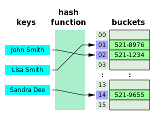
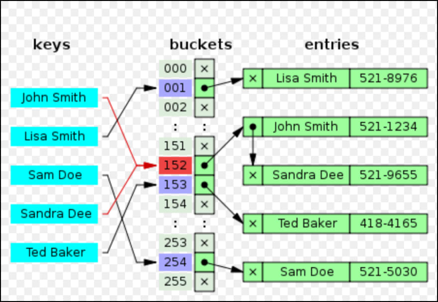

## How hashmaps work?

Okay, so lets start with what hashmaps are?
Hashmaps or hashtables are known by different names in different languages.

* Python has dict/dictionaries  
* Ruby calls it Hash  
* Java has hashmap  
* C++ has unordered_map
* Even Javascript has maps, which is how basically objects are implemented in javascript. (just look at JSON)

What the last point says about hashmaps being used to implement objects in Javascript is also true in case of Python, Ruby and a few others.

So hashmaps/dicts/hashtables whatever you want to call them are basically key-value storage data structures. You pass in a value identified by a key, and you can get back the same value with that key - simple as that.

***

So lets try and get hands on with how it looks in code.

```python
a = {}

# add a key-value pair
a['name'] = 'ishan'

# lets see whats in there
print(a)
# {'name': 'ishan'}

# add more key-value pairs
a['age'] = 23
a['gender'] = 'male'
print(a)
# {'gender': 'male', 'age': 23, 'name': 'ishan'}

# note above that the keys are not in the same order as we entered them,
# this is because python's dictionaries are unordered
# see https://stackoverflow.com/a/15479974/2972348

# get a specific value
print(a['name'])
# 'ishan'

# let's update a value
a['age'] = 24
print(a)
# {'gender': 'male', 'age': 24, 'name': 'ishan'}

# let's delete some values
del a['age']
print(a)
# {'gender': 'male', 'name': 'ishan'}
```

That gives us the list of basic operations on a dict:

1. insert
2. fetch
3. delete

The same can be shown with Javascript:
```javascript
a = {}

a['name'] = 'ishan'
console.log(a)
// { name: 'ishan' }

// or the other way
a.age = 24
console.log(a)
// { name: 'ishan', age: 24 }

console.log(a.name)
// ishan

delete a.age
console.log(a)
// { name: 'ishan' }
```

Enough of examples now, lets get to see how these things work on the inside

***

So, we will be implementing a simple hashtable in [Golang](https://golang.org/). If you haven’t heard or written code in Go, and are skeptical about understanding the code that follows - worry not, Go has a syntax very similar to C and Javascript. And if you can code (in a language), you’re gonna do just fine!

***

## The building blocks

This image taken from wikipedia shows the basic structure of our hashtable. This will help us understand and break down the problem at hand better:
  


To summarize, we have:

* the hash function
* the linear array that the hash function maps to
* and the actual data nodes that hold our key-value pairs

## The array

So lets start with our __*linear array*__ to begin with. So we basically need a statically allocated array of some size n. This will be the array holding the pointer to our actual key value pairs. This is how our basic array will look like:
```
  +----+
1 |    |
  +----+
2 |    |
  +----+
3 |    |
  +----+
4 |    |
  +----+
5 |    |
  +----+
6 |    |
  +----+
7 |    |
  +----+
8 |    |
  +----+
9 |    |
  +----+
10|    |
  +----+
```

Let us code this up in Go. To have a basic array inside our hashmap data type. This is going to be fairly easy to achieve.

```go
package main

import "fmt"

const MAP_SIZE = 50

type HashMap struct {
	Data []*int	
}

func NewDict() *HashMap {
	return &HashMap{}	
}

func main() {
	a := NewDict()
}
```

The above code is explained below:

1. We declare the current file as main package with package main.
2. We import a package called “fmt”, we’ll later use it to print things to terminal.
3. We declare a constant variable MAP_SIZE with value 50 . This will be the size of our linear array.
    > For the sake of simplicity, we are assuming that we just have a fixed size array that we use for implementing our hashmap, and we don’t take resizing into account. Actual implementations do account for these things - which will be covered in a future blog post. For more info refer here.

4. Next we create a function NewDict that creates this array for us and returns a pointer to it.

This completes our bare-bones structure for the array itself. But we are presented with the next challenge. Which is, how to represent the key-value pairs that contain our actual data and link it with our array.

### Creating the nodes and linking with array

There is one problem in the code presented above — we have created an array of __*pointer to integer*__ values. Basically the `Data []*int` on __line8__. This is wrong because we need to actually __not__ point to integers but to __*some*__ object that holds our key-value pairs. We don’t know what that object will be yet, but we know that it needs at least 2 fields — key and value. So lets go ahead and create this new object’s structure in our code.

We add the following lines:
```go
type Node struct {
    key string
    value string
    next *Node
}
```

We create a structure to hold our key-value pairs and a __*pointer to a Node*__ type. We will need this pointer later on in order to deal with hash conflicts. More on this later, for now just let it sit around there.

Now since we want every index of our array to point to these __*Node*__ type, we should change the type of our data array.

```go
type HashMap struct {
    Data []*Node
}
```

So at the end of these changes, this is how our code should look like:
```go
package main
import "fmt"
const MAP_SIZE = 50

type Node struct {
    key string
    value string
    next *Node
}

type HashMap struct {
    Data []*Node
}

func NewDict() *HashMap {
    return &HashMap{ Data: make([]*Node, MAP_SIZE) }
    // we initialize our array with make(), see 
    // https://golang.org/pkg/builtin/#make

}

func main() {
    a := NewDict()
    fmt.Println("%q", a)

}
```

If you run this program right now, you should see something like this:
```go
&{[<nil> <nil> <nil> <nil> <nil> <nil> <nil> <nil> <nil> <nil>
<nil> <nil> <nil> <nil> <nil> <nil> <nil> <nil> <nil> <nil>
<nil> <nil> <nil> <nil> <nil> <nil> <nil> <nil> <nil> <nil>
<nil> <nil> <nil> <nil> <nil> <nil> <nil> <nil> <nil> <nil>
<nil> <nil> <nil> <nil> <nil> <nil> <nil> <nil> <nil> <nil>]}
```

We have our hashmap object consisting of an __*array of 50 pointers*__ each pointing to `<nil>` which is something equivalent to:
* `NULL` in C.
* `null` in Java.
* `None` in Python.
* `undefined` in Javascript.

This is just as expected, we haven’t inserted any value in the hash table so all pointers are pointing to `null`/`nil` . Next we have to think about inserting objects into our hashmap.

> Before we could even reach that, we need to find a way to convert our keys to corresponding indexes on the array.

A typical implementation of hash maps relies on a good hash function. The job of a hash function is to convert the value passed to it (in our current case, a string) and return an integer value representing an index on the array. And this integer value __*has to be the same every time*__.

This means that if `hash("hello")` gives me `966170508347869221`, then every time I pass `"hello"` I should get the same `966170508347869221` as a return value.

> You can test the above mentioned code in the Python interpreter. Python has a builtin function `hash` that will return the hash value.

But we cannot have index `966170508347869221` on our array. Currently we have only indexes `1-49` available. Hence we need to somehow bring it down to this range.

### Modulo to the rescue

The simplest solution to this problem is using the modulo (`%`) operator. This operator gives us the remainder of the division performed. That is, if  

`966170508347869221 / 50 = 19323410166957384 + 21` 

then `966170508347869221 % 50 = 21`. The remainder.

But with this, we have another problem, there will be *keys* which will be mapped to the same index, hence we’ll get a hash collision.

From this point on, we have 3 problems to solve at hand:
1. How do you implement the hash function.
2. Make the hash value fall in range of our array.
3. How to manage hash collisions.

> Let’s start with the hash generation function first

### Choosing a hash algorithm

Wikipedia has a list of many __*hash_functions*__. Which you can refer here https://en.wikipedia.org/wiki/List_of_hash_functions

For our purpose, we’ll use a [Jenkins hash function](https://en.wikipedia.org/wiki/Jenkins_hash_function). It is a hash function that produces 32-bit hashes. The wikipedia article also has the implementation of the algorithm in C. We’ll just translate that to our go code.

```go
func hash(key string) (hash uint32) {
    hash = 0
    for _, ch := range key {
        hash += uint32(ch)
        hash += hash << 10
        hash ^= hash >> 6
    }

    hash += hash << 3
    hash ^= hash >> 11
    hash += hash << 15

    return
}
```

The above function uses a named-return — see https://golang.org/doc/effective_go.html#named-results

With this in place our code should look like this:
```go
package main

import "fmt"

const MAP_SIZE = 50

type Node struct {
    key string
    value string
    next *Node
}

type HashMap struct {
    Data []*Node
}

func hash(key string) (hash uint32) {
    hash = 0
    for _, ch := range key {
        hash += uint32(ch)
        hash += hash << 10
        hash ^= hash >> 6
    }
    hash += hash << 3
    hash ^= hash >> 11
    hash += hash << 15
    return
}

func NewDict() *HashMap {
    return &HashMap{ Data: make([]*Node, MAP_SIZE) }
    // we initialize our array with make(), see 
    // https://golang.org/pkg/builtin/#make
}

func main() {
    a := NewDict()
    fmt.Println(a)
}
```

***

### Mapping the hash to our array

Now that we have found our way to convert our keys to the hash value, we now need to make sure that this value falls within out array. For this we implement a `getIndex` function:

```go
func getIndex(key string) (index int) {
  return int(hash(key)) % MAP_SIZE
}
```

With this in place, we have taken care of 2 of our 3 problem statements. The 3rd problem - managing collisions will be taken care of at a later stage. First we now need to focus on inserting the key-value pairs in our array. Lets write a function for that.

## Insertion

The following function uses a [receiver](https://tour.golang.org/methods/4), which are a powerful feature of go.

```go
func (h *HashMap) Insert(key string, value string) {
  index := getIndex(key)
  
  if h.Data[index] == nil {
    // index is empty, go ahead and insert
    h.Data[index] = &Node{key: key, value: value}
  } else {
    // there is a collision, get into linked-list mode
    starting_node := h.Data[index]
    for ; starting_node.next != nil; starting_node = starting_node.next {
      if starting_node.key == key {
        // the key exists, its a modifying operation
        starting_node.value = value
        return
      }
    }
    starting_node.next = &Node{key: key, value: value}
  }
}
```

The code is mostly self explanatory, but we'll briefly go over it anyway.

We first call `getIndex` with the `key`, which in-turns calls the `hash` function __*internally*__. This gives us the `index` on our array where we can store that key-value pair.

Next we check if the index is empty, if yes - then we simply store the K-V Pair there. This would look something like this:

```
  +----+
1 |    |
  +----+
2 |    |
  +----+     +------------------+
3 | *  |---->| Key: Value       |
  +----+     | Next: nil        |
4 |    |     +------------------+
  +----+
5 |    |
  +----+     +------------------+
6 | *  |---->| Key: Value       |
  +----+     | Next: nil        |
7 |    |     +------------------+
  +----+
8 |    |
  +----+
9 |    |
  +----+
10|    |
  +----+
```

The above denotes the `if` part of our code - when there are no collisions. The else part of our code handles the collision.

There are a few different ways of handling collisions in hashmaps:

1. Separate chaining with linked lists
2. Open addressing
3. Double Hashing

The current code in the else block handles collisions with the __Separate chaining with linked lists__ technique.

The linked list technique will result in a data structure very similar to the following image:



The two keys mapping to the same index - hence resulting in a collision are shown in red.

Next we'll talk about retrieving the value back from our hashtable

***

### Fetch

The next basic operation on hashmaps that we are going to look at is `Fetch`. Fetch is fairly simple and identical to insert - we pass our `key` as input to the hash function and get a hash value, which is then mapped to our array using the `getIndex` function.

We can then have 3 possible outcomes:
1. We check if the `key` on that index is matching the we are looking for - if yes, then we have our match.
2. If the key does not match, we check if its next value is __not__ `nil` - basically checking for collision and find that element in the *separate chained linked list*
3. If both of the above conditions fail, we concur that the requested key does not exist in our hashtable.

The code implementing the above explanation is shown below:

```go
func (h *HashMap) Get(key string) (string, bool) {
  index := getIndex(key)
  if h.Data[index] != nil {
    // key is on this index, but might be somewhere in linked list
    starting_node := h.Data[index]
    for ; ; starting_node = starting_node.next {
      if starting_node.key == key {
        // key matched
        return starting_node.value, true
      }
      
      if starting_node.next == nil {
        break
      }
    }
  }

  // key does not exists
  return "", false
}
```

> The above code uses golang's [multiple return values](https://gobyexample.com/multiple-return-values) feature.

With this in place, we'll write the main function and test these operations that we have implemented.

```go
func main() {
  a := NewDict()
  a.Insert("name", "ishan")
  a.Insert("gender", "male")
  a.Insert("city", "mumbai")
  a.Insert("lastname", "khare")
  if value, ok := a.Get("name"); ok {
    fmt.Println(value);
  } else {
    fmt.Println("Value did not match!")
  }
  
  fmt.Println(a)
}
```

Also lets add a convenience function that allows us to print our hashmap in the desired format.
```go
func (h *HashMap) String() string {
  var output bytes.Buffer
  fmt.Fprintln(&output, "{")
  for _, n := range h.Data {
    if n != nil {
      fmt.Fprintf(&output, "\t%s: %s\n", n.key, n.value)
      for node := n.next; node != nil; node = node.next {
        fmt.Fprintf(&output, "\t%s: %s\n", node.key, node.value)
      }
    }
  }
  
  fmt.Fprintln(&output, "}")
  
  return output.String()
}
```

This overrides the default print output for our defined `HashMap` type.
> The above method is just a convenience method used for printing the entire hashmap in a pretty format. It is in no way required for proper functioning of the data structure

To sum it up, here's our final code:

```go
package main

import (
  "fmt"
  "bytes"
  )

const MAP_SIZE = 10

type Node struct {
  key string
  value string
  next *Node
}

type HashMap struct {
  Data []*Node
}

func NewDict() *HashMap {
  return &HashMap{ Data: make([]*Node, MAP_SIZE) } 
}

func (n *Node) String() string {
  return fmt.Sprintf("<Key: %s, Value: %s>\n", n.key, n.value)
}

func (h *HashMap) String() string {
  var output bytes.Buffer
  fmt.Fprintln(&output, "{")
  for _, n := range h.Data {
    if n != nil {
      fmt.Fprintf(&output, "\t%s: %s\n", n.key, n.value)
      for node := n.next; node != nil; node = node.next {
        fmt.Fprintf(&output, "\t%s: %s\n", node.key, node.value)
      }
    }
  }
  
  fmt.Fprintln(&output, "}")
  
  return output.String()
}

func (h *HashMap) Insert(key string, value string) {
  index := getIndex(key)
  
  if h.Data[index] == nil {
    // index is empty, go ahead and insert
    h.Data[index] = &Node{key: key, value: value}
  } else {
    // there is a collision, get into linked-list mode
    starting_node := h.Data[index]
    for ; starting_node.next != nil; starting_node = starting_node.next {
      if starting_node.key == key {
        // the key exists, its a modifying operation
        starting_node.value = value
        return
      }
    }
    starting_node.next = &Node{key: key, value: value}
  }
}

func (h *HashMap) Get(key string) (string, bool) {
  index := getIndex(key)
  if h.Data[index] != nil {
    // key is on this index, but might be somewhere in linked list
    starting_node := h.Data[index]
    for ; ; starting_node = starting_node.next {
      if starting_node.key == key {
        // key matched
        return starting_node.value, true
      }
      
      if starting_node.next == nil {
        break
      }
    }
  }

  // key does not exists
  return "", false
}

func hash(key string) (hash uint8) {
  // a jenkins one-at-a-time-hash
  // refer https://en.wikipedia.org/wiki/Jenkins_hash_function

  hash = 0
  for _, ch := range key {
    hash += uint8(ch)
    hash += hash << 10
    hash ^= hash >> 6
  }
  
  hash += hash << 3
  hash ^= hash >> 11
  hash += hash << 15
  
  return 
}

func getIndex(key string) (index int) {
  return int(hash(key)) % MAP_SIZE
}

func main() {
  a := NewDict()
  a.Insert("name", "ishan")
  a.Insert("gender", "male")
  a.Insert("city", "mumbai")
  a.Insert("lastname", "khare")
  if value, ok := a.Get("name"); ok {
    fmt.Println(value);
  } else {
    fmt.Println("Value did not match!")
  }
  
  fmt.Println(a)
}
```

***

### Running

On running the above code, we get the following output:

```
ishan
{
	city: mumbai
	name: ishan
	lastname: khare
	gender: male
}
```

* The first line is the value of our key `name`.
* The output from 2nd line onwards is basically our custom-coded pretty-print function that outputs our entire hashmap.

If you're interested in running/experimenting with this code, please feel free to fork the following repl. You can also play around on this webpage interactively.

<iframe height="400px" width="100%" src="https://repl.it/@ishankhare07/hashmaps?lite=true" scrolling="no" frameborder="no" allowtransparency="true" allowfullscreen="true" sandbox="allow-forms allow-pointer-lock allow-popups allow-same-origin allow-scripts allow-modals"></iframe>

***

Our current implementation only supports strings as keys. In the next blog post we'll talk about how we can make this a more generic implementation.

This post was originally published on my blog at ishankhare.com
