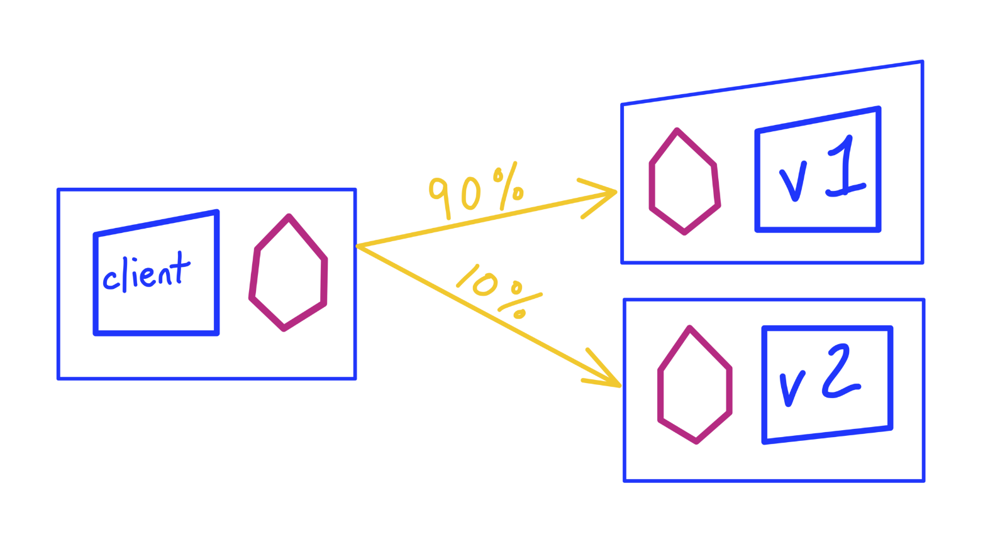

## What we'll cover in this post?

This post in general is about how we can leverage kubernetes controllers and the [kubernetes resource model](https://github.com/kubernetes/community/blob/master/contributors/design-proposals/architecture/resource-management.md) to automate and manage heavy lifting of tricky deployment and management scenarios.

Controller are often explained in layman terms as *software-SRE's*. The good thing about that is:

* They are always available and ready to step in when things go wrong.
* They have all the operational logic in the form of code related to the steps to take when certain things don't work.
* They don't need to go over runbooks/playbooks or other documentations to fix issues.
* Since they are always watching resources and their states (as we'll see later in this post), they don't have to spend time 
to *find* where the errors/misconfiguration happened.

This can give us a few positive outcomes:

* Humans don't have to be on hectic on-call schedules.
* In cases of errors, the software itself is healing the system, hence the MTTR(mean time to response) is considerably decreased.

> "With great power comes great responsibilities". With all the advantages of implementing controllers, they also come with high cost of implementation details. 
> Implementing controllers is generally more complex than traditional systems.

Now that we know a bit about controllers, we'll take a use case and try to implement a controller to solve it.

## Tl;Dr

If you want to directly go ahead and checkout the code implementation and test it on your local machine, I have the entire thing residing
in this – [github.com/ishankhare07/launchpad](https://github.com/ishankhare07/launchpad) repo. There is a detailed readme which walks you through
a Makefile that:

* Sets up a local kind cluster
* Installs Istio on it
* Deploys demo workloads(Deployments)
* Applies the right Istio CRD's – a `VirtualService` and a `DestinationRule` to achieve a traffic split.
* Check and verify the traffic split.

It then also walks you through the controller way of doing things and also the magic of *Software-SRE's* that they bring along.

## Use case

The use case we are trying to tackle here is doing a traffic split using a a service mesh. Since this blog post can only have limited scope, what we will NOT talk about is:

* Service mesh in general or service mesh comparison. We'll just go ahead and use Istio.
* We'll not go into the details of how Istio or any other service mesh works.

The specific scenario we would want to cover is a `Traffic Split`/`Canary`. More details can be found by giving a look at this awesome example site – [istiobyexample.dev/canary](https://www.istiobyexample.dev/canary) – by [@askmeegs](https://twitter.com/askmeegs). Borrowing the following screenshot from that same article, demonstrating what we want to achieve:



The page also details how we can achieve this by creating Istio specific CRD's. We'll look at both the approaches and see the advantages first-hand where controllers come in.

Below are the Istio CRD's that we would want to create in the cluster in order for Istio to do things for us:  
`DestinationRule`

```yaml
apiVersion: networking.istio.io/v1alpha3
kind: DestinationRule
metadata:
  name: helloworld
spec:
  host: helloworld
  subsets:
    - name: v1
      labels:
        version: v1
    - name: v2
      labels:
        version: v2
```

`VirtualService`

```yaml
apiVersion: networking.istio.io/v1alpha3
kind: VirtualService
metadata:
  name: helloworld
spec:
  hosts:
  - helloworld
  http:
  - route:
    - destination:
        host: helloworld
        subset: v1
      weight: 80
    - destination:
        host: helloworld
        subset: v2
      weight: 20
```

Too much going around the core of this post, lets dive in now.
***

> This post uses the awesome [kubebuilder](https://github.com/kubernetes-sigs/kubebuilder) framework for implementing the controller. If you're unfamiliar about it and want an intro
> I've written a previous article about it on my blog which you can read here – [Writing a kubernetes controller in Go with kubebuilder](https://ishankhare.dev/posts/6/)

***

## The Deep Dive


We'll start by initializing our project for the controller using `go mod` and the `kubebuilder` framework

```shell
$ go mod init github.com/ishankhare07/launchpad
$ kubebuilder init --domain ishankhare.dev

# create scaffolding for the project
$ kubebuilder create api --group labs --version v1alpha1 --kind Workload
Create Resource [y/n]
y
Create Controller [y/n]
y
Writing scaffold for you to edit...
```

### The CRD

Next step is to define the CRD which we want to use for defining our traffic split to our controller. We want roughly the following yaml spec for it:

```yaml
apiVersion: labs.ishankhare.dev/v1alpha1
kind: Workload
metadata:
  name: workload-sample
spec:
  host: helloworld
  targets:
    - name: helloworld-v1
      namespace: default
      trafficSplit:
        hosts:
          - helloworld
        subset:
          name: v1
          labels:
            version: v1
        destinationHost: helloworld
        weight: 80
    - name: helloworld-v2
      namespace: default
      trafficSplit:
        hosts:
          - helloworld
        subset:
          name: v2
          labels:
            version: v2
        destinationHost: helloworld
        weight: 20
```

I know there's room for improvement and this can be refined further, but for the purpose of this post, this should do fine. Lets go about defining this spec in our `api/v1alpha1/workload_types.go`

```go
...

const (
	PhasePending = "PENDING"
	PhaseCreated = "CREATED"
)

// +kubebuilder:object:root=true
// +kubebuilder:subresource:status

// Workload is the Schema for the workloads API
type Workload struct {
	metav1.TypeMeta   `json:",inline"`
	metav1.ObjectMeta `json:"metadata,omitempty"`

	Spec   WorkloadSpec   `json:"spec,omitempty"`
	Status WorkloadStatus `json:"status,omitempty"`
}

type WorkloadSpec struct {
	// INSERT ADDITIONAL SPEC FIELDS - desired state of cluster
	// Important: Run "make" to regenerate code after modifying this file

	// Host is the name of the service from the service registry
	Host string `json:"host,omitempty"`

	Targets []DeploymentTarget `json:"targets,omitempty"`
}

// WorkloadStatus defines the observed state of Workload
type WorkloadStatus struct {
	// INSERT ADDITIONAL STATUS FIELD - define observed state of cluster
	// Important: Run "make" to regenerate code after modifying this file
	VirtualServiceState  string `json:"virtualServiceState,omitempty"`
	DestinationRuleState string `json:"destinationRuleState,omitempty"`
}

type DeploymentTarget struct {
	Name         string       `json:"name,omitempty"`
	Namespace    string       `json:"namespace,omitempty"`
	TrafficSplit TrafficSplit `json:"trafficSplit,omitempty"`
}

type TrafficSplit struct {
	Hosts           []string          `json:"hosts,omitempty"`
	Subset          Subset            `json:"subset,omitempty"`
	DestinationHost string            `json:"destinationHost,omitempty"`
	Weight          int               `json:"weight,omitempty"`
}

type Subset struct {
	Name   string            `json:"name,omitempty"`
	Labels map[string]string `json:"labels,omitempty"`
}

func (w *Workload) GetIstioResourceName() string {
	return w.Spec.Host // strings.Split(w.Spec.Targets[0].Name, "-")[0]
}

func (w *Workload) GetHosts() []string {
	// need hosts as a set data structure
	hostSet := make(map[string]bool)
	hosts := []string{}

	for _, target := range w.Spec.Targets {
		for _, host := range target.TrafficSplit.Hosts {
			hostSet[host] = true
		}
	}

	for host := range hostSet {
		hosts = append(hosts, host)
	}

	return hosts
}
```

This should be enough to define our define the yaml that we presented before. If you're following along the code in the repo, the above is defined in [api/v1alpha1/workload_types.go](https://github.com/ishankhare07/launchpad/blob/master/api/v1alpha1/workload_types.go). We also add some additional helper methods on the objects that will be useful later.

### The controller

Let's jump to [controllers/workload_controller.go](https://github.com/ishankhare07/launchpad/blob/master/controllers/workload_controller.go). I'm only going to show the relevant sections of the code here in favour of brevity. For detailed code one can go and see the linked file.

```go
...


func (r *WorkloadReconciler) Reconcile(ctx context.Context, req ctrl.Request) (ctrl.Result, error) {
	reqLogger := r.Log.WithValues("workload", req.NamespacedName)

	// your logic here
	reqLogger.Info("====== Reconciling Workload =======")
	instance := &labsv1alpha1.Workload{}

	err := r.Get(context.TODO(), req.NamespacedName, instance)
	if err != nil {
		// object not found, could have been deleted after
		// reconcile request, hence don't requeue
		if errors.IsNotFound(err) {
			return ctrl.Result{}, nil
		}
		// error reading the object, requeue the request
		return ctrl.Result{}, err
	}

	reqLogger.Info("Workload created for following targets.")
	for _, target := range instance.Spec.Targets {
		reqLogger.Info("target",
			"name", target.Name,
			"namespace", target.Namespace,
			"hosts", fmt.Sprintf("%v", target.TrafficSplit.Hosts))
		reqLogger.Info("subset",
			"subset name", target.TrafficSplit.Subset.Name,
			"subset labels", fmt.Sprintf("%v", target.TrafficSplit.Subset.Labels),
			"weight", target.TrafficSplit.Weight)
	}

	// check current status of owned resources
	if instance.Status.VirtualServiceState == "" {
		instance.Status.VirtualServiceState = labsv1alpha1.PhasePending
	}

	if instance.Status.DestinationRuleState == "" {
		instance.Status.DestinationRuleState = labsv1alpha1.PhasePending
	}

	// check virtual service status
	vsResult, err := r.checkVirtualServiceStatus(instance, req, reqLogger)
	if err != nil {
		return vsResult, err
	}

	// check destination rule status
	destRuleResult, err := r.checkDestinationRuleStatus(instance, req, reqLogger)
	if err != nil {
		return destRuleResult, err
	}

	// update status
	err = r.Status().Update(context.TODO(), instance)
	if err != nil {
		return ctrl.Result{}, err
	}

	return ctrl.Result{}, nil
}
```

Here we are simply logging what the controller "sees" is requested to be created as *"desired state"* through the CRD.
Next we are calling the relevant functions `checkVirtualServiceStatus` and `checkDestinationRuleStatus`. There implementation is explained below, with just the following intention:
> If the `VirtualService` or `DestinationRule` doesn't exist yet, try to create it with the correct spec.

### The VirtualService check

In the same file let's implement the `checkVirtualServiceStatus` method, please scroll to the right for extra comments explaining each section:

```go
...

func (r *WorkloadReconciler) checkVirtualServiceStatus(instance *labsv1alpha1.Workload, req ctrl.Request, logger logr.Logger) (ctrl.Result, error) {
	switch instance.Status.VirtualServiceState {
	case labsv1alpha1.PhasePending:
		logger.Info("Virtual Service", "PHASE:", instance.Status.VirtualServiceState)			// If still in pending state (initial condition)
		logger.Info("Transitioning state to create Virtual Service")							// transition to the creating state	 
		instance.Status.VirtualServiceState = labsv1alpha1.PhaseCreated							//
	case labsv1alpha1.PhaseCreated:
		logger.Info("Virtual Service", "PHASE:", instance.Status.VirtualServiceState)				//
		query := &istiov1alpha3.VirtualService{}													// create an empty query object
																									//
		// check if virtual service already exists													//---------\
		lookupKey := types.NamespacedName{															//			\
			Name:      instance.GetIstioResourceName(),												//			 --- construct the query object
			Namespace: instance.GetNamespace(),														//			/
		}																							//---------/
		err := r.Get(context.TODO(), lookupKey, query)												// query result
		if err != nil && errors.IsNotFound(err) {													//
			logger.Info("virtual service not found but should exist", "lookup key", lookupKey)		//
			logger.Info(err.Error())																//
			// virtual service got deleted or hasn't been created yet								//
			// create one now																		//
			vs := spawn.CreateVirtualService(instance)												// create the actual virtual service as defined by Istio
			err = ctrl.SetControllerReference(instance, vs, r.Scheme)								// Set owner references on the created object
			if err != nil {																			//
				logger.Error(err, "Error setting controller reference")								//
				return ctrl.Result{}, err															//
			}																						//
																									// 
			err = r.Create(context.TODO(), vs)														// request the API server to create the actual object in
			if err != nil {																			// the cluster i.e. persist in the etcd store
				logger.Error(err, "Unable to create Virtual Service")								//
				return ctrl.Result{}, err															//
			}																						//
																									//
			logger.Info("Successfully created virtual service")										//
		} else if err != nil {																		//
			logger.Error(err, "Unable to create Virtual Service")									//
			return ctrl.Result{}, err																//
		} else {																					//
			// don't requeue, it will happen automatically when										//
			// virtual service status changes														//
			return ctrl.Result{}, nil																//
		}																							//

		// more fields related to virtual service status can be checked
		// see more at https://pkg.go.dev/istio.io/api/meta/v1alpha1#IstioStatus

	}

	return ctrl.Result{}, nil
}
```

The line `vs := spawn.CreateVirtualService(instance)` defines another function to create the actual `Istio` `VirtualService` for us which we will define further in the `spawn` package.

### The DestinationRule check

Similar to the virtual service, we'll create the `checkDestinationRuleStatus` method in the same file:

``` go
...

func (r *WorkloadReconciler) checkDestinationRuleStatus(instance *labsv1alpha1.Workload, req ctrl.Request, logger logr.Logger) (ctrl.Result, error) {
	switch instance.Status.DestinationRuleState {
	case labsv1alpha1.PhasePending:
		logger.Info("Destination Rule", "PHASE:", instance.Status.DestinationRuleState)
		logger.Info("Transitioning state to create Destination Rule")
		instance.Status.DestinationRuleState = labsv1alpha1.PhaseCreated
	case labsv1alpha1.PhaseCreated:
		logger.Info("Destination Rule", "PHASE:", instance.Status.DestinationRuleState)
		query := &istiov1alpha3.DestinationRule{}

		// check if destination rule already exists
		lookupKey := types.NamespacedName{
			Name:      instance.GetIstioResourceName(),
			Namespace: instance.GetNamespace(),
		}
		err := r.Get(context.TODO(),
			lookupKey, query)
		if err != nil && errors.IsNotFound(err) {
			logger.Info("destination rule not found but should exist", "req key", lookupKey)
			logger.Info(err.Error())
			// destination rule got deleted or hasn't been created yet
			// create one now

			dr := spawn.CreateDestinationRule(instance)
			err := ctrl.SetControllerReference(instance, dr, r.Scheme)
			if err != nil {
				logger.Error(err, "Error setting controller reference")
				return ctrl.Result{}, err
			}

			err = r.Create(context.TODO(), dr)
			if err != nil {
				logger.Error(err, "Unable to create Destination Rule")
				return ctrl.Result{}, err
			}

			logger.Info("Successfully created Destination Rule")
		} else if err != nil {
			logger.Error(err, "Unable to create destination rule")
			return ctrl.Result{}, err
		} else {
			// don't requeue, it will happen automatically when
			// destination rule status changes
			return ctrl.Result{}, nil
		}
	}

	return ctrl.Result{}, nil
}
```

The line `dr := spawn.CreateDestinationRule(instance)` defines another function to create the actual `Istio` `DestinationRule` for us, which we will define further in the `spawn` package.

### Creating the Istio CRD's (defining the 'spawn') package

Let's create the following two files in the `pkg` directory:

1. [destination-rule.go](https://github.com/ishankhare07/launchpad/blob/master/pkg/spawn/destination-rule.go)
2. [virtual-service.go](https://github.com/ishankhare07/launchpad/blob/master/pkg/spawn/virtual-service.go)

The structure should be as follows:

```shell
$ tree ./pkg
./pkg
└── spawn
    ├── destination-rule.go
    └── virtual-service.go
```

In the file [`virtual-service.go`](https://github.com/ishankhare07/launchpad/blob/master/pkg/spawn/virtual-service.go)

```go
package spawn

import (
	labsv1alpha1 "github.com/ishankhare07/launchpad/api/v1alpha1"
	istionetworkingv1alpha3 "istio.io/api/networking/v1alpha3"				// ---------\
																			// 			 - import the required Istio structures (CRD's)
	istiov1alpha3 "istio.io/client-go/pkg/apis/networking/v1alpha3"			// ---------/
	metav1 "k8s.io/apimachinery/pkg/apis/meta/v1"
)

func CreateVirtualService(workload *labsv1alpha1.Workload) *istiov1alpha3.VirtualService {
	vs := &istiov1alpha3.VirtualService{
		ObjectMeta: metav1.ObjectMeta{
			Name:      workload.GetIstioResourceName(),
			Namespace: "default",
		},
	}

	routeDestination := []*istionetworkingv1alpha3.HTTPRouteDestination{}

	for _, target := range workload.Spec.Targets {
		// extract route from CRD
		route := &istionetworkingv1alpha3.HTTPRouteDestination{
			Destination: &istionetworkingv1alpha3.Destination{
				Host:   target.TrafficSplit.DestinationHost,
				Subset: target.TrafficSplit.Subset.Name,
			},
			Weight: int32(target.TrafficSplit.Weight),
		}

		// append routes into route destination
		routeDestination = append(routeDestination, route)
	}

	// append route destination to VirtualService.Routes
	vs.Spec.Http = append(vs.Spec.Http, &istionetworkingv1alpha3.HTTPRoute{
		Route: routeDestination,
	})

	// set hosts
	vs.Spec.Hosts = workload.GetHosts()

	return vs
}

```

We import the right structures from the Istio's upstream repo and construct the object based on the values provided in our original `Workload` CRD.
In the similar way we define the destination rule object generation in the file [`destination-rule.go`](https://github.com/ishankhare07/launchpad/blob/master/pkg/spawn/destination-rule.go)

```go
package spawn

import (
	labsv1alpha1 "github.com/ishankhare07/launchpad/api/v1alpha1"
	istionetworkingv1alpha3 "istio.io/api/networking/v1alpha3"
	istiov1alpha3 "istio.io/client-go/pkg/apis/networking/v1alpha3"
	metav1 "k8s.io/apimachinery/pkg/apis/meta/v1"
)

func CreateDestinationRule(workload *labsv1alpha1.Workload) *istiov1alpha3.DestinationRule {
	dr := &istiov1alpha3.DestinationRule{
		ObjectMeta: metav1.ObjectMeta{
			Name:      workload.GetIstioResourceName(),
			Namespace: workload.GetNamespace(),
		},
	}

	for _, target := range workload.Spec.Targets {
		dr.Spec.Subsets = append(dr.Spec.Subsets, &istionetworkingv1alpha3.Subset{
			Name:   target.TrafficSplit.Subset.Name,
			Labels: target.TrafficSplit.Subset.Labels,
		})
	}

	dr.Spec.Host = workload.Spec.Host

	return dr
}
```

### Telling the controller to 'watch' the resources we own

One last trick left in the implementation of our controller is, when we set the Owner references for each created `VirtualService` and `DestinationRule` in these lines:
```go
...
err = ctrl.SetControllerReference(instance, vs, r.Scheme)
...

err := ctrl.SetControllerReference(instance, dr, r.Scheme)
...
```

We are essentially telling kubernetes that these objects are "owned" by *THIS* controller  
We can then ask kubernetes to send is events related to these "OWNED" resources whenever anything happens with them (delete/update)

To do this we go back to the end of the [`controllers/workload_controller.go`](https://github.com/ishankhare07/launchpad/blob/master/controllers/workload_controller.go) and add the following:

```go
func (r *WorkloadReconciler) SetupWithManager(mgr ctrl.Manager) error {
	return ctrl.NewControllerManagedBy(mgr).
		For(&labsv1alpha1.Workload{}).
		Owns(&istiov1alpha3.VirtualService{}).        // we own both these type of objects
		Owns(&istiov1alpha3.DestinationRule{}).       // hence send us events related to these
		Complete(r)
}
```

### Are we done?

One last thing. Since `Istio`'s `VirtualService` and `DestinationRule` are external kubernetes obejcts (for which we have registered the CRD's while installing istio), we are still using *raw golang* objects / structs and passing it to the [`controller-runtime`](https://github.com/kubernetes-sigs/controller-runtime) client.  
The client needs some additional information to "map the golang obejcts with the registered crds".
> Note that the golang objects we created don't have information like `apiVersion`, `kind`
Hence to provide this information we need to register something called as a `scheme`.  

A Scheme basically maps the Go object to what we call GVK(*GroupVersionKind*) in kubernetes. This is usually auto generated when CRD's are defined using any framework like kubebuilder or operatorsdk. There's even one generated for our `Workload` kind which you can take a look at here – [api/v1alpha1/groupversion_info.go](https://github.com/ishankhare07/launchpad/blob/master/api/v1alpha1/groupversion_info.go)

```go
...

var (
	// GroupVersion is group version used to register these objects
	GroupVersion = schema.GroupVersion{Group: "labs.ishankhare.dev", Version: "v1alpha1"}

	// SchemeBuilder is used to add go types to the GroupVersionKind scheme
	SchemeBuilder = &scheme.Builder{GroupVersion: GroupVersion}

	// AddToScheme adds the types in this group-version to the given scheme.
	AddToScheme = SchemeBuilder.AddToScheme
)
```

A similar scheme is defined by the `Istio` library, which we can register in our [main.go](https://github.com/ishankhare07/launchpad/blob/master/main.go#L47)

```go
import (
        ...
        istioscheme "istio.io/client-go/pkg/clientset/versioned/scheme"
        ...
)

...

func init() {
        ...
        _ = istioscheme.AddToScheme(scheme)
}
```

Now we are done! You can follow along the [Controller-demo](https://github.com/ishankhare07/launchpad/blob/master/README.md#controller-demo) to see the magic happen!

### Some final highlights

As pointed out the [final sections of the demo](https://github.com/ishankhare07/launchpad/blob/master/README.md#is-that-it), even if someone/something accidentally or deliberately deletes either of the `VirtualService` or the `DestinationRule`, the controller immediately steps in and recreates it for us.

> One more trick left to showcase. If you were to go and delete either the VirtualService or the DestinationRule now, since the controller is watching over them, it will instantly recreate it with the correct configuration. This simulates an actual human error which have triggered alerts for the team in the past only to realise that somewhere, somebody did a kubectl delete vs helloworld. Go ahead, try it. Then try to run `kubectl get vs,dr` again.

Lastly I'd like to mention the awesome work being done by folks at [@crossplane](https://twitter.com/crossplane_io) and [@hasheddan](https://twitter.com/hasheddan) who are building some really cool stuff leveraging the controllers and the KRM(kubernetes resource model). If you're more interested, checkout the following resources:

1. [Kubernetes as a Framework for Control Planes](https://blog.upbound.io/how-the-kubernetes-resource-model-enables-configuration-as-data/).
2. Crossplane team integrating GKE Autopilot before the night ends [on live stream](https://www.youtube.com/watch?v=3VddZSTPc4Y).

### What's next?

In a follow-up post I'll talk about how we can bring [Admission Webhooks](https://kubernetes.io/docs/reference/access-authn-authz/extensible-admission-controllers/#what-are-admission-webhooks), particularly Validating Admission Webhooks into the picture and make sure nobody's able to create our `Workload` CRD with wrong values – like a traffic split that doesn't add up to a 100% for eg. (`80:30` or `40:30`)

This post was original posted on my personal blog [ishankhare.dev](https://ishankhare.dev)